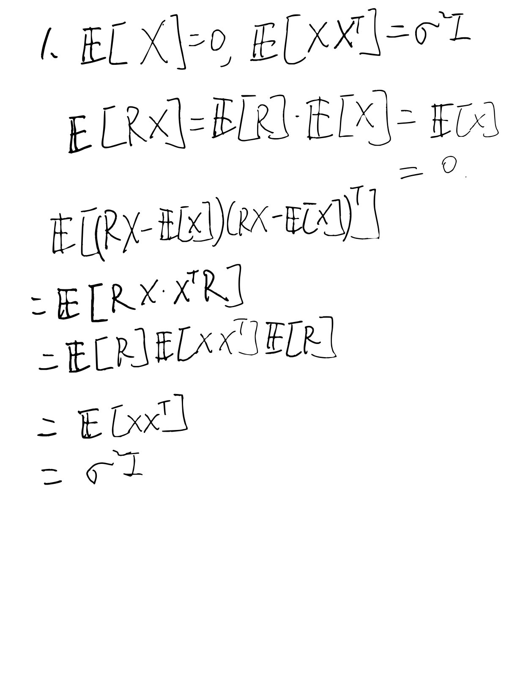
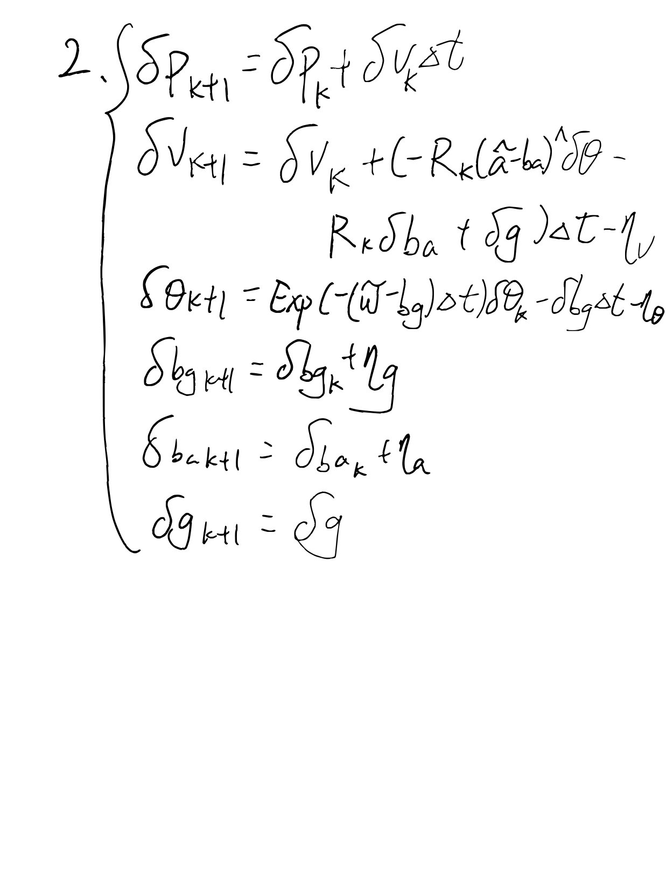
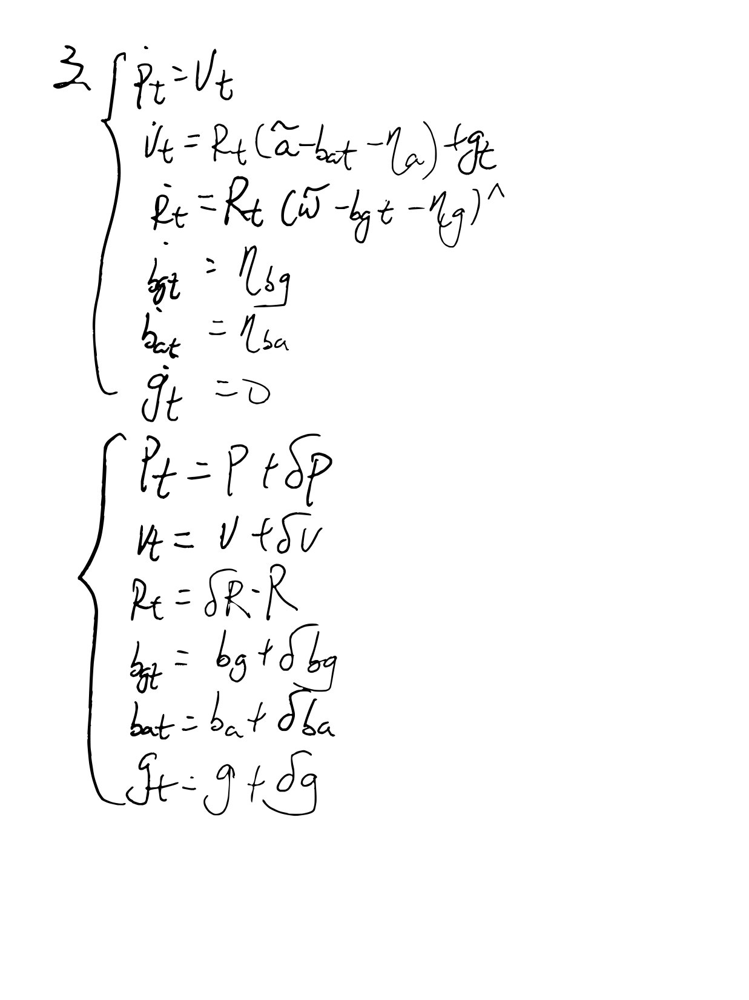
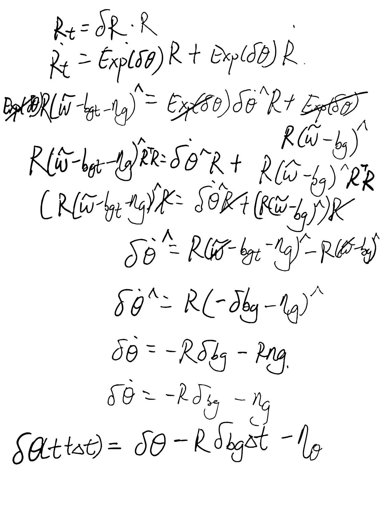
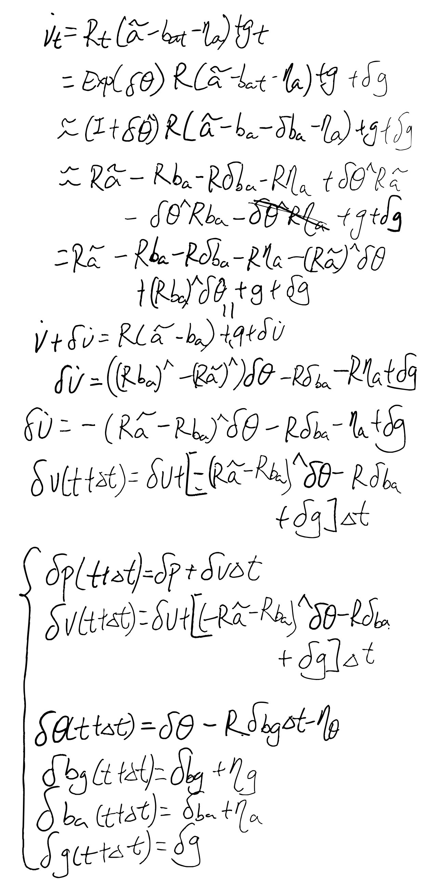
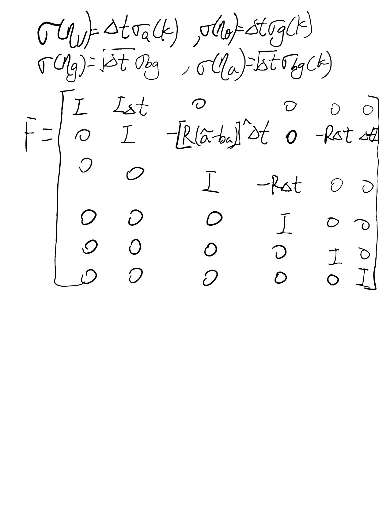
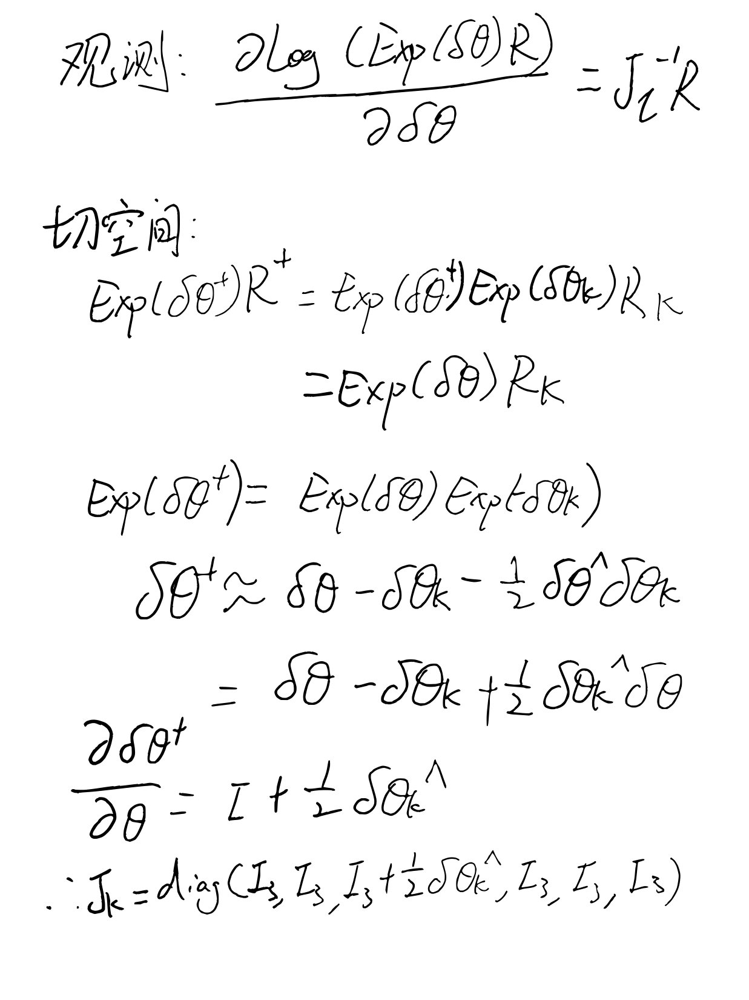
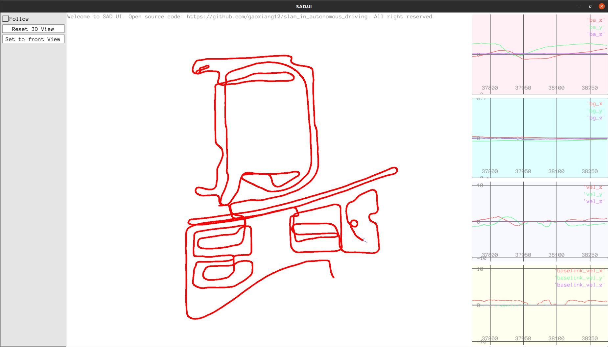

P1:




P2:


基本上就是把矩阵乘出来写：

```
    Vec18T new_dx = Vec18T::Zero();
    new_dx.template block<3,1>(0,0) = new_dx.template block<3,1>(0,0) + new_dx.template block<3,1>(3,0) * dt;
    new_dx.template block<3,1>(3,0) = new_dx.template block<3,1>(3,0) + (-R_.matrix() * SO3::hat(imu.acce_ - ba_) * new_dx.template block<3,1>(6,0)
                               - R_.matrix()*new_dx.template block<3,1>(12,0) + new_dx.template block<3,1>(15,0)) * dt;
    new_dx.template block<3,1>(6,0) = SO3::exp(- (imu.gyro_ - bg_) * dt).matrix() * new_dx.template block<3,1>(6,0) - new_dx.template block<3,1>(9,0) * dt;
    new_dx.template block<3,1>(9,0) = new_dx.template block<3,1>(9,0);
    new_dx.template block<3,1>(12,0) = new_dx.template block<3,1>(12,0);
    new_dx.template block<3,1>(15,0) = new_dx.template block<3,1>(15,0);

```

P3:






更新名义变量
```
/// 更新名义状态变量，重置error state
    void UpdateAndReset() {
        p_ += dx_.template block<3, 1>(0, 0);
        v_ += dx_.template block<3, 1>(3, 0);
        // R_ = R_ * SO3::exp(dx_.template block<3, 1>(6, 0));
        //   左绕动
        R_ = SO3::exp(dx_.template block<3, 1>(6, 0)) * R_;

        if (options_.update_bias_gyro_) {
            bg_ += dx_.template block<3, 1>(9, 0);
        }

        if (options_.update_bias_acce_) {
            ba_ += dx_.template block<3, 1>(12, 0);
        }

        g_ += dx_.template block<3, 1>(15, 0);

        ProjectCov();
        dx_.setZero();
    }
```


IMU的递推更新用左绕动，还有F矩阵用左绕动推导出来的形式
```
template <typename S>
bool ESKF<S>::Predict(const IMU& imu) {
    assert(imu.timestamp_ >= current_time_);

    double dt = imu.timestamp_ - current_time_;
    if (dt > (5 * options_.imu_dt_) || dt < 0) {
        // 时间间隔不对，可能是第一个IMU数据，没有历史信息
        LOG(INFO) << "skip this imu because dt_ = " << dt;
        current_time_ = imu.timestamp_;
        return false;
    }

    Vec18T new_dx = Vec18T::Zero();
    new_dx.template block<3,1>(0,0) = new_dx.template block<3,1>(0,0) + new_dx.template block<3,1>(3,0) * dt;
    new_dx.template block<3,1>(3,0) = new_dx.template block<3,1>(3,0) + (-R_.matrix() * SO3::hat(imu.acce_ - ba_) * new_dx.template block<3,1>(6,0)
                               - R_.matrix()*new_dx.template block<3,1>(12,0) + new_dx.template block<3,1>(15,0)) * dt;
    new_dx.template block<3,1>(6,0) = SO3::exp(- (imu.gyro_ - bg_) * dt).matrix() * new_dx.template block<3,1>(6,0) - new_dx.template block<3,1>(9,0) * dt;
    new_dx.template block<3,1>(9,0) = new_dx.template block<3,1>(9,0);
    new_dx.template block<3,1>(12,0) = new_dx.template block<3,1>(12,0);
    new_dx.template block<3,1>(15,0) = new_dx.template block<3,1>(15,0);

    // nominal state 递推
    VecT new_p = p_ + v_ * dt + 0.5 * (R_ * (imu.acce_ - ba_)) * dt * dt + 0.5 * g_ * dt * dt;
    VecT new_v = v_ + R_ * (imu.acce_ - ba_) * dt + g_ * dt;
    // SO3 new_R = R_ * SO3::exp((imu.gyro_ - bg_) * dt);
    //   左绕动
    SO3 new_R = SO3::exp((imu.gyro_ - bg_) * dt) * R_;

    R_ = new_R;
    v_ = new_v;
    p_ = new_p;
    // 其余状态维度不变

    // error state 递推
    // 计算运动过程雅可比矩阵 F，见(3.47)
    // F实际上是稀疏矩阵，也可以不用矩阵形式进行相乘而是写成散装形式，这里为了教学方便，使用矩阵形式
    Mat18T F = Mat18T::Identity();                                                 // 主对角线
    // F.template block<3, 3>(0, 3) = Mat3T::Identity() * dt;                         // p 对 v
    // F.template block<3, 3>(3, 6) = -R_.matrix() * SO3::hat(imu.acce_ - ba_) * dt;  // v对theta
    // F.template block<3, 3>(3, 12) = -R_.matrix() * dt;                             // v 对 ba
    // F.template block<3, 3>(3, 15) = Mat3T::Identity() * dt;                        // v 对 g
    // F.template block<3, 3>(6, 6) = SO3::exp(-(imu.gyro_ - bg_) * dt).matrix();     // theta 对 theta
    // F.template block<3, 3>(6, 9) = -Mat3T::Identity() * dt;                        // theta 对 bg

    //   左绕动
    F.template block<3, 3>(0, 3) = Mat3T::Identity() * dt;                         // p 对 v
    F.template block<3, 3>(3, 6) = -SO3::hat(R_.matrix() * (imu.acce_ - ba_)) * dt;  // v对theta
    F.template block<3, 3>(3, 12) = -R_.matrix() * dt;                             // v 对 ba
    F.template block<3, 3>(3, 15) = Mat3T::Identity() * dt;                        // v 对 g
    F.template block<3, 3>(6, 6) = Mat3T::Identity();     // theta 对 theta
    F.template block<3, 3>(6, 9) = -R_.matrix() * dt;                        // theta 对 bg
    

    // mean and cov prediction
    dx_ = F * dx_;  // 这行其实没必要算，dx_在重置之后应该为零，因此这步可以跳过，但F需要参与Cov部分计算，所以保留
    cov_ = F * cov_.eval() * F.transpose() + Q_;
    current_time_ = imu.timestamp_;
    return true;
}
```

GNSS更新也用左绕动
```
template <typename S>
bool ESKF<S>::ObserveSE3(const SE3& pose, double trans_noise, double ang_noise) {
    /// 既有旋转，也有平移
    /// 观测状态变量中的p, R，H为6x18，其余为零
    Eigen::Matrix<S, 6, 18> H = Eigen::Matrix<S, 6, 18>::Zero();
    H.template block<3, 3>(0, 0) = Mat3T::Identity();  // P部分
    H.template block<3, 3>(3, 6) = Mat3T::Identity();  // R部分（3.66)

    // 卡尔曼增益和更新过程
    Vec6d noise_vec;
    noise_vec << trans_noise, trans_noise, trans_noise, ang_noise, ang_noise, ang_noise;

    Mat6d V = noise_vec.asDiagonal();
    Eigen::Matrix<S, 18, 6> K = cov_ * H.transpose() * (H * cov_ * H.transpose() + V).inverse();

    // 更新x和cov
    Vec6d innov = Vec6d::Zero();
    innov.template head<3>() = (pose.translation() - p_);          // 平移部分
    // innov.template tail<3>() = (R_.inverse() * pose.so3()).log();  // 旋转部分(3.67)
    // 左绕动
    innov.template tail<3>() = (pose.so3() * R_.inverse()).log();  // 旋转部分(3.67)

    dx_ = K * innov;
    cov_ = (Mat18T::Identity() - K * H) * cov_;

    UpdateAndReset();
    return true;
}
```

方差矩阵的投影
```
/// 对P阵进行投影，参考式(3.63)
    void ProjectCov() {
        Mat18T J = Mat18T::Identity();
        // J.template block<3, 3>(6, 6) = Mat3T::Identity() - 0.5 * SO3::hat(dx_.template block<3, 1>(6, 0));
        //   左绕动
        J.template block<3, 3>(6, 6) = Mat3T::Identity() + 0.5 * SO3::hat(dx_.template block<3, 1>(6, 0));
        cov_ = J * cov_ * J.transpose();
    }
```

结果和原来一样：

