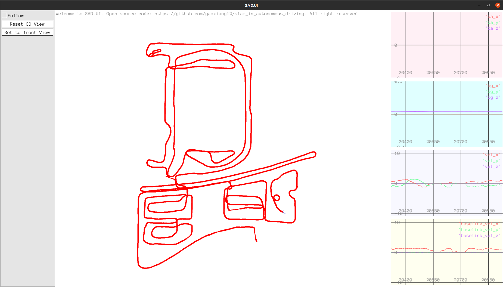

P1:


P2:


可以看出，因为Odom的频率快很多，在一些GNSS信号不好的地方路径也没有偏离
基本上就是把Optimize()函数从AddGNSS里面加到AddOdom()


```
void GinsPreInteg::AddGnss(const GNSS& gnss) {
    this_frame_ = std::make_shared<NavStated>(current_time_);
    this_gnss_ = gnss;

    if (!first_gnss_received_) {
        if (!gnss.heading_valid_) {
            // 要求首个GNSS必须有航向
            return;
        }

        // 首个gnss信号，将初始pose设置为该gnss信号
        this_frame_->timestamp_ = gnss.unix_time_;
        this_frame_->p_ = gnss.utm_pose_.translation();
        this_frame_->R_ = gnss.utm_pose_.so3();
        this_frame_->v_.setZero();
        this_frame_->bg_ = options_.preinteg_options_.init_bg_;
        this_frame_->ba_ = options_.preinteg_options_.init_ba_;

        pre_integ_ = std::make_shared<IMUPreintegration>(options_.preinteg_options_);

        last_frame_ = this_frame_;
        last_gnss_ = this_gnss_;
        first_gnss_received_ = true;
        current_time_ = gnss.unix_time_;
        return;
    }

    // 积分到GNSS时刻
    pre_integ_->Integrate(last_imu_, gnss.unix_time_ - current_time_);

    current_time_ = gnss.unix_time_;
    *this_frame_ = pre_integ_->Predict(*last_frame_, options_.gravity_);

    // Optimize();

    last_frame_ = this_frame_;
    last_gnss_ = this_gnss_;
}

void GinsPreInteg::AddOdom(const sad::Odom& odom) {
    last_odom_ = odom;
    last_odom_set_ = true;
    Optimize();
}
```

P3:
我将第一次optimize的Hessian矩阵拿出来
自动求导的话就是将EdgeInertial::linearizeOplus()注释掉（声明和定义都注释掉）
再将Hessian矩阵输出出来

推导出来的雅各比算出的Hessian
```
/// 更新名义状态变量，重置error state
1.10006e+07      -65.135      1500.92       989713       521926     -52000.6      94408.2      49789.9     -4657.26 -1.02432e+06     -360.331      139.439     -1.65863      5088.19      215.952 -1.09494e+07        531.7      23534.4      -989713      -521926      52000.6     -1944.26     -1028.93     -200.901
     -65.135  1.10006e+07      1600.07      -522399       989441      3462.38     -49845.7      94400.1      2358.32      360.901 -1.02432e+06      1188.26     -5088.08     -1.83491     -256.519     -555.378 -1.09493e+07      38132.7       522399      -989441     -3462.38      1040.58     -1961.47     -2034.84
     1500.92      1600.07  1.09646e+07     -12476.1      54815.3     -509.406      744.456      5908.35     -41.3428      -134.97     -1186.63 -1.02435e+06      -218.79      255.609    -0.264925     -21499.4     -36974.5 -1.09643e+07      12476.1     -54815.3      509.406     -1910.03     -787.222     -6.24852
      989713      -522399     -12476.1  1.59897e+08      70.2793      1590.72   7.2937e+06    0.0467103      40.6368     -2205.75      1173.53      229.962     -7624.86     -14514.7      269.476      -979679       516989      94517.2 -1.59897e+08     -70.2793     -1590.72  7.64466e+06      6.51914      107.976
      521926       989441      54815.3      70.2793  1.59897e+08      908.737      3.54801  7.29371e+06      35.1931      -1172.7     -2207.25     -138.554      14513.2     -7622.09       151.13      -516290      -979001     -73458.9     -70.2793 -1.59897e+08     -908.737      3.01783  7.64465e+06      49.7057
    -52000.6      3462.38     -509.406      1590.72      908.737  1.59919e+08      25.0796     -7.01877  7.29431e+06      249.559      130.657     -1.57291     -7.15158      299.234      16433.3       110579      57968.8      788.733     -1590.72     -908.737 -1.59919e+08      123.533      91.9176  7.64609e+06
     94408.2     -49845.7      744.456   7.2937e+06      3.54801      25.0796       442272    -0.135967      4.29385     -12.4197      7.15292      10.2115      4427.93      8391.95      68.8308     -5091.53      2676.19      4265.12  -7.2937e+06     -3.54801     -25.0796       239142      0.46744     -1.95078
     49789.9      94400.1      5908.35    0.0467103  7.29371e+06     -7.01877    -0.135967       442273     -3.27826     -6.98808     -12.3649     -2.33354     -8391.65      4428.35     -77.0333     -2666.99     -5058.36     -448.072   -0.0467103 -7.29371e+06      7.01877     0.140331       239142      2.62253
    -4657.26      2358.32     -41.3428      40.6368      35.1931  7.29431e+06      4.29385     -3.27826       442357      5.40849      8.00195    -0.181816      101.196      25.0452     -9493.41      2394.08      3605.88      13.7742     -40.6368     -35.1931 -7.29431e+06    -0.497355      6.56617       239114
-1.02432e+06      360.901      -134.97     -2205.75      -1172.7      249.559     -12.4197     -6.98808      5.40849      95700.3   -0.0511761   0.00122713  -0.00532054        9.571     0.589146  1.02441e+06     -414.343     -1965.15      2205.75       1172.7     -249.559     -193.653     -102.572      17.9065
    -360.331 -1.02432e+06     -1186.63      1173.53     -2207.25      130.657      7.15292     -12.3649      8.00195   -0.0511761      95700.3  -0.00135807     -9.57361    0.0165575    -0.269457      409.459  1.02441e+06     -2319.65     -1173.53      2207.25     -130.657      102.485     -193.847      4.20464
     139.439      1188.26 -1.02435e+06      229.962     -138.554     -1.57291      10.2115     -2.33354    -0.181816   0.00122713  -0.00135807      95700.1    -0.365182     0.136498   0.00716675      1966.23      2325.92  1.02435e+06     -229.962      138.554      1.57291      11.2727     -10.6109    0.0348673
    -1.65863     -5088.08      -218.79     -7624.86      14513.2     -7.15158      4427.93     -8391.65      101.196  -0.00532054     -9.57361    -0.365182      958.031   0.00148646   -0.0456869     -2.32611     -4295.89     -253.067      7624.86     -14513.2      7.15158     -5140.29      9747.54     -101.864
     5088.19     -1.83491      255.609     -14514.7     -7622.09      299.234      8391.95      4428.35      25.0452        9.571    0.0165575     0.136498   0.00148646      958.029   -0.0263235      4295.77     -1.51752      117.625      14514.7      7622.09     -299.234     -9747.99     -5140.45      2.91078
     215.952     -256.519    -0.264925      269.476       151.13      16433.3      68.8308     -77.0333     -9493.41     0.589146    -0.269457   0.00716675   -0.0456869   -0.0263235      958.686      261.329     -125.243      -0.0105     -269.476      -151.13     -16433.3      -43.655      91.1525      11028.7
-1.09494e+07     -555.378     -21499.4      -979679      -516290       110579     -5091.53     -2666.99      2394.08  1.02441e+06      409.459      1966.23     -2.32611      4295.77      261.329  1.09905e+07      2.67547      195.679       979679       516290      -110579       -86435     -45567.4      7936.75
       531.7 -1.09493e+07     -36974.5       516989      -979001      57968.8      2676.19     -5058.36      3605.88     -414.343  1.02441e+06      2325.92     -4295.89     -1.51752     -125.243      2.67547  1.09904e+07       1813.4      -516989       979001     -57968.8      45623.6     -86404.9      1809.86
     23534.4      38132.7 -1.09643e+07      94517.2     -73458.9      788.733      4265.12     -448.072      13.7742     -1965.15     -2319.65  1.02435e+06     -253.067      117.625      -0.0105      195.679       1813.4  1.09646e+07     -94517.2      73458.9     -788.733      4565.15     -6414.83      59.9132
     -989713       522399      12476.1 -1.59897e+08     -70.2793     -1590.72  -7.2937e+06   -0.0467103     -40.6368      2205.75     -1173.53     -229.962      7624.86      14514.7     -269.476       979679      -516989     -94517.2  1.59897e+08      70.2793      1590.72 -7.64466e+06     -6.51914     -107.976
     -521926      -989441     -54815.3     -70.2793 -1.59897e+08     -908.737     -3.54801 -7.29371e+06     -35.1931       1172.7      2207.25      138.554     -14513.2      7622.09      -151.13       516290       979001      73458.9      70.2793  1.59897e+08      908.737     -3.01783 -7.64465e+06     -49.7057
     52000.6     -3462.38      509.406     -1590.72     -908.737 -1.59919e+08     -25.0796      7.01877 -7.29431e+06     -249.559     -130.657      1.57291      7.15158     -299.234     -16433.3      -110579     -57968.8     -788.733      1590.72      908.737  1.59919e+08     -123.533     -91.9176 -7.64609e+06
    -1944.26      1040.58     -1910.03  7.64466e+06      3.01783      123.533       239142     0.140331    -0.497355     -193.653      102.485      11.2727     -5140.29     -9747.99      -43.655       -86435      45623.6      4565.15 -7.64466e+06     -3.01783     -123.533       475060     0.141611      12.0384
    -1028.93     -1961.47     -787.222      6.51914  7.64465e+06      91.9176      0.46744       239142      6.56617     -102.572     -193.847     -10.6109      9747.54     -5140.45      91.1525     -45567.4     -86404.9     -6414.83     -6.51914 -7.64465e+06     -91.9176     0.141611       475060      2.02123
    -200.901     -2034.84     -6.24852      107.976      49.7057  7.64609e+06     -1.95078      2.62253       239114      17.9065      4.20464    0.0348673     -101.864      2.91078      11028.7      7936.75      1809.86      59.9132     -107.976     -49.7057 -7.64609e+06      12.0384      2.02123       475222
```


自动求导算出来的Hessian矩阵：

```
 1.10006e+07     -65.1124      1499.54       989713       521926     -52000.5      94408.2      49789.9     -4657.26 -1.02432e+06     -360.517      139.578     -1.65855      5088.19      215.952 -1.09494e+07       531.67      23535.8      -989713      -521926      52000.5     -1944.26     -1028.93     -200.895
    -65.1124  1.10006e+07      1599.14      -522399       989441      3462.34     -49845.7      94400.1      2358.32      361.095 -1.02432e+06      1188.38     -5088.08     -1.83471     -256.519     -555.371 -1.09493e+07      38133.6       522399      -989441     -3462.34      1040.58     -1961.47     -2034.85
     1499.54      1599.14  1.09646e+07     -12476.1      54815.4     -509.407      744.455      5908.35     -41.3428     -136.062     -1188.73 -1.02435e+06      -218.79      255.609     -0.26493     -21499.4     -36973.9 -1.09643e+07      12476.1     -54815.4      509.407     -1910.03     -787.221     -6.24855
      989713      -522399     -12476.1  1.59897e+08      70.3077      1590.82   7.2937e+06    0.0411282      40.6368     -2205.75      1173.51      229.982     -7624.86     -14514.8      269.498      -979679       516989      94517.2 -1.59897e+08     -70.3077     -1590.82  7.64466e+06      6.51409      107.985
      521926       989441      54815.4      70.3077  1.59897e+08      908.769      3.58794  7.29371e+06      35.1946     -1172.69     -2207.25      -138.56      14513.2     -7622.07      151.127      -516290      -979001     -73458.9     -70.3077 -1.59897e+08     -908.769      2.99878  7.64465e+06      49.7172
    -52000.5      3462.34     -509.407      1590.82      908.769  1.59919e+08      25.2415     -7.27096  7.29431e+06      249.063      130.221     -1.37233     -7.27223      299.058      16433.3       110579      57968.8      788.733     -1590.82     -908.769 -1.59919e+08       123.46       92.186  7.64609e+06
     94408.2     -49845.7      744.455   7.2937e+06      3.58794      25.2415       442272    -0.134824      4.30002     -12.4193       7.1527      10.2123      4427.93      8391.95      68.8318     -5091.53      2676.19      4265.12  -7.2937e+06     -3.58794     -25.2415       239142     0.469421     -1.94188
     49789.9      94400.1      5908.35    0.0411282  7.29371e+06     -7.27096    -0.134824       442273     -3.28576     -6.98782     -12.3643     -2.33335     -8391.65      4428.36     -77.0337     -2666.99     -5058.36     -448.072   -0.0411282 -7.29371e+06      7.27096     0.139497       239142      2.60693
    -4657.26      2358.32     -41.3428      40.6368      35.1946  7.29431e+06      4.30002     -3.28576       442357      5.38638      7.98463    -0.171083       101.19      25.0403      -9493.4      2394.08      3605.88      13.7742     -40.6368     -35.1946 -7.29431e+06    -0.499921      6.57443       239114
-1.02432e+06      361.095     -136.062     -2205.75     -1172.69      249.063     -12.4193     -6.98782      5.38638      95700.3   -0.0519336     0.102381  -0.00526224      9.57101     0.589051  1.02441e+06     -414.533     -1964.06      2205.75      1172.69     -249.063     -193.653     -102.571      17.8824
    -360.517 -1.02432e+06     -1188.73      1173.51     -2207.25      130.221       7.1527     -12.3643      7.98463   -0.0519336      95700.3      0.19105     -9.57363    0.0166679    -0.269738      409.648  1.02441e+06     -2317.55     -1173.51      2207.25     -130.221      102.483     -193.848      4.18127
     139.578      1188.38 -1.02435e+06      229.982      -138.56     -1.37233      10.2123     -2.33335    -0.171083     0.102381      0.19105      95700.5    -0.365228     0.136507   0.00703898      1966.23      2325.83  1.02435e+06     -229.982       138.56      1.37233      11.2738     -10.6117    0.0428727
    -1.65855     -5088.08      -218.79     -7624.86      14513.2     -7.27223      4427.93     -8391.65       101.19  -0.00526224     -9.57363    -0.365228      958.031   0.00150924   -0.0456902     -2.32616     -4295.89     -253.067      7624.86     -14513.2      7.27223     -5140.29      9747.54      -101.87
     5088.19     -1.83471      255.609     -14514.8     -7622.07      299.058      8391.95      4428.36      25.0403      9.57101    0.0166679     0.136507   0.00150924      958.029   -0.0266501      4295.77     -1.51783      117.625      14514.8      7622.07     -299.058        -9748     -5140.45      2.89919
     215.952     -256.519     -0.26493      269.498      151.127      16433.3      68.8318     -77.0337      -9493.4     0.589051    -0.269738   0.00703898   -0.0456902   -0.0266501      958.686      261.329     -125.243   -0.0104855     -269.498     -151.127     -16433.3     -43.6538      91.1528      11028.7
-1.09494e+07     -555.371     -21499.4      -979679      -516290       110579     -5091.53     -2666.99      2394.08  1.02441e+06      409.648      1966.23     -2.32616      4295.77      261.329  1.09905e+07      2.68023      195.672       979679       516290      -110579       -86435     -45567.4      7936.75
      531.67 -1.09493e+07     -36973.9       516989      -979001      57968.8      2676.19     -5058.36      3605.88     -414.533  1.02441e+06      2325.83     -4295.89     -1.51783     -125.243      2.68023  1.09904e+07      1812.75      -516989       979001     -57968.8      45623.6     -86404.9      1809.86
     23535.8      38133.6 -1.09643e+07      94517.2     -73458.9      788.733      4265.12     -448.072      13.7742     -1964.06     -2317.55  1.02435e+06     -253.067      117.625   -0.0104855      195.672      1812.75  1.09646e+07     -94517.2      73458.9     -788.733      4565.15     -6414.83      59.9132
     -989713       522399      12476.1 -1.59897e+08     -70.3077     -1590.82  -7.2937e+06   -0.0411282     -40.6368      2205.75     -1173.51     -229.982      7624.86      14514.8     -269.498       979679      -516989     -94517.2  1.59897e+08      70.3077      1590.82 -7.64466e+06     -6.51409     -107.985
     -521926      -989441     -54815.4     -70.3077 -1.59897e+08     -908.769     -3.58794 -7.29371e+06     -35.1946      1172.69      2207.25       138.56     -14513.2      7622.07     -151.127       516290       979001      73458.9      70.3077  1.59897e+08      908.769     -2.99878 -7.64465e+06     -49.7172
     52000.5     -3462.34      509.407     -1590.82     -908.769 -1.59919e+08     -25.2415      7.27096 -7.29431e+06     -249.063     -130.221      1.37233      7.27223     -299.058     -16433.3      -110579     -57968.8     -788.733      1590.82      908.769  1.59919e+08      -123.46      -92.186 -7.64609e+06
    -1944.26      1040.58     -1910.03  7.64466e+06      2.99878       123.46       239142     0.139497    -0.499921     -193.653      102.483      11.2738     -5140.29        -9748     -43.6538       -86435      45623.6      4565.15 -7.64466e+06     -2.99878      -123.46       475060     0.140028      12.0341
    -1028.93     -1961.47     -787.221      6.51409  7.64465e+06       92.186     0.469421       239142      6.57443     -102.571     -193.848     -10.6117      9747.54     -5140.45      91.1528     -45567.4     -86404.9     -6414.83     -6.51409 -7.64465e+06      -92.186     0.140028       475060      2.03854
    -200.895     -2034.85     -6.24855      107.985      49.7172  7.64609e+06     -1.94188      2.60693       239114      17.8824      4.18127    0.0428727      -101.87      2.89919      11028.7      7936.75      1809.86      59.9132     -107.985     -49.7172 -7.64609e+06      12.0341      2.03854       475222
```
可以看出来两种方法算出来的Hessian差不了太多。基本误差在小数位第二位后。
