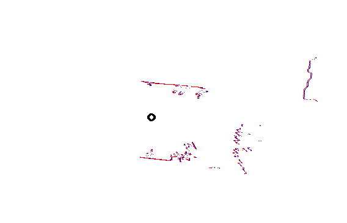
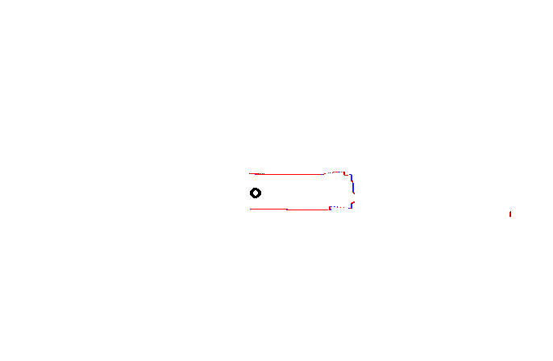
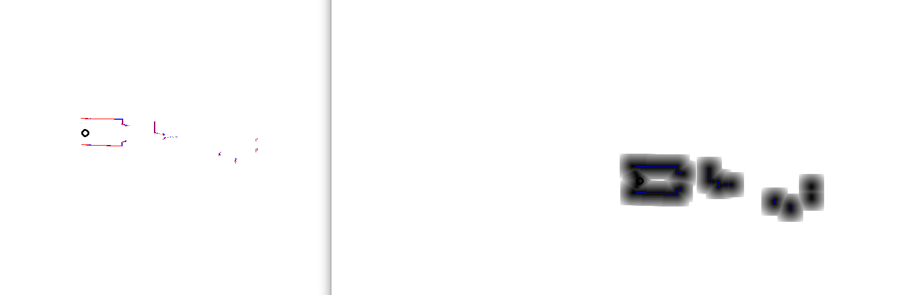
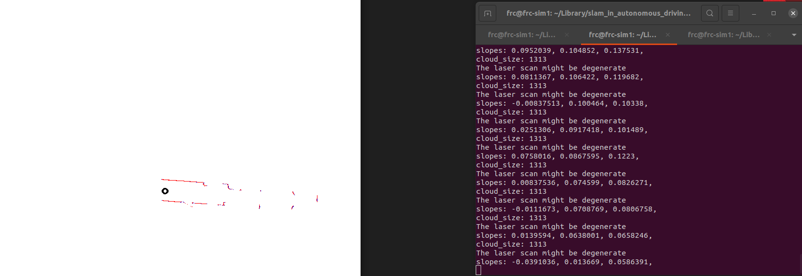

P1:
点到点的ICP

边的定义，由于测量值不应该改变，所以将测量值直接放在边的构造函数中：

```
class EdgeICP_P2P : public g2o::BaseUnaryEdge<2, Vec2d, VertexSE2> {
   public:
    EIGEN_MAKE_ALIGNED_OPERATOR_NEW;
    EdgeICP_P2P() {}
    EdgeICP_P2P(double rho_, double r_, Vec2d q_i_): rho(rho_), r(r_), q_i(q_i_){}

    void computeError() override {
        VertexSE2* current_pose = (VertexSE2*)_vertices[0];
        double x_ = current_pose->estimate().translation()[0];
        double y_ = current_pose->estimate().translation()[1];
        double theta_ = current_pose->estimate().so2().log();
        Vec2d p_i = {x_ + r * std::cos(rho+theta_), y_ + r * std::sin(rho+theta_)};
        _error = p_i - q_i;
    }

    // TODO jacobian
    void linearizeOplus() override {
        VertexSE2* current_pose = (VertexSE2*)_vertices[0];
        double theta_ = current_pose->estimate().so2().log();
        _jacobianOplusXi << 1, 0, 0, 1, -r * std::sin(rho + theta_), r * std::cos(rho + theta_);
    }
    bool read(std::istream& is) override { return true; }
    bool write(std::ostream& os) const override { return true; }

   private:
        double rho;
        double r;
        double theta_, x_, y_;
        Vec2d q_i;
};
```

借用了AlignGaussNewton和likelihood的部分函数，把有效的测量值转换成世界坐标的点后找NN，将NN的坐标和测量值构造边。所有边构造完之后进行优化， 比较奇怪的是g2o的求解器在for循环外面构造的话会让跑的速度变得很慢。

```
ICP的函数：

bool Icp2d::AlignGaussNewtonP2P(SE2& init_pose) {
    SE2 current_pose = init_pose;

    const double range_th = 15.0;  // 不考虑太远的scan，不准
    const double rk_delta = 0.8;
    const float max_dis2 = 0.01; 

    
    for (int iter = 0; iter < 3; iter++){
        using BlockSolverType = g2o::BlockSolver<g2o::BlockSolverTraits<3, 1>>;
        using LinearSolverType = g2o::LinearSolverCholmod<BlockSolverType::PoseMatrixType>;
        auto* solver = new g2o::OptimizationAlgorithmLevenberg(
            g2o::make_unique<BlockSolverType>(g2o::make_unique<LinearSolverType>()));
        g2o::SparseOptimizer optimizer;
        optimizer.setAlgorithm(solver);
        auto* v = new VertexSE2();
        v->setId(0);
        v->setEstimate(current_pose);
        optimizer.addVertex(v);

    // 遍历source
        for (size_t i = 0; i < source_scan_->ranges.size(); ++i) {
            double r = source_scan_->ranges[i];
            if (r < source_scan_->range_min || r > source_scan_->range_max) {
                continue;
            }

            if (r > range_th) {
                continue;
            }

            double angle = source_scan_->angle_min + i * source_scan_->angle_increment;
            if (angle < source_scan_->angle_min + 30 * M_PI / 180.0 || angle > source_scan_->angle_max - 30 * M_PI / 180.0) {
                continue;
            }

            Vec2d q_i;

            Vec2d pw = current_pose * Vec2d(r * std::cos(angle), r * std::sin(angle));
            Point2d pt;
            pt.x = pw.x();
            pt.y = pw.y();
            // 最近邻
            std::vector<int> nn_idx;
            std::vector<float> dis;
            kdtree_.nearestKSearch(pt, 1, nn_idx, dis);

            if (nn_idx.size() > 0 && dis[0] < max_dis2) {
                Vec2d qw = Vec2d(target_cloud_->points[nn_idx[0]].x, target_cloud_->points[nn_idx[0]].y);  

                auto e = new EdgeICP_P2P(angle, r, qw);
                e->setVertex(0, v);
                e->setInformation(Eigen::Matrix<double, 2, 2>::Identity());
                auto rk = new g2o::RobustKernelHuber;
                rk->setDelta(rk_delta);
                e->setRobustKernel(rk);
                optimizer.addEdge(e);
            }
        }

        optimizer.setVerbose(false);
        optimizer.initializeOptimization();
        optimizer.optimize(1);
        current_pose = v->estimate();
    }

    init_pose = current_pose;
    return true;

}

```




P2L的实现：
边的定义：
和课件上的差别不多，用线的常量来构建残差和雅各比

```
class EdgeICP_P2L : public g2o::BaseUnaryEdge<1, double, VertexSE2> {
   public:
    EIGEN_MAKE_ALIGNED_OPERATOR_NEW;
    EdgeICP_P2L() {}
    EdgeICP_P2L(double rho_, double r_, Vec3d abc_): rho(rho_), r(r_), abc(abc_){}

    void computeError() override {
        VertexSE2* current_pose = (VertexSE2*)_vertices[0];
        double x_ = current_pose->estimate().translation()[0];
        double y_ = current_pose->estimate().translation()[1];
        double theta_ = current_pose->estimate().so2().log();
        Vec2d p_i = {x_ + r * std::cos(rho+theta_), y_ + r * std::sin(rho+theta_)};
        _error[0] = p_i[0] * abc[0] + p_i[1] * abc[1] + abc[2];
    }

    // TODO jacobian
    void linearizeOplus() override {
        VertexSE2* current_pose = (VertexSE2*)_vertices[0];
        double theta_ = current_pose->estimate().so2().log();
        _jacobianOplusXi << abc[0], abc[1], -abc[0]*r*std::sin(theta_+rho) + abc[1]*r*std::cos(theta_+rho);
    }
    bool read(std::istream& is) override { return true; }
    bool write(std::ostream& os) const override { return true; }

   private:
        double rho;
        double r;
        Vec3d abc;
};
```

ICP的实现：
和上面P2P的实现差不多，就是找测量值在世界坐标里的5NN，再用5NN做线拟合。得出来的常量构建边。

```

bool Icp2d::AlignGaussNewtonP2L(SE2& init_pose) {
    SE2 current_pose = init_pose;

    const double range_th = 15.0;  // 不考虑太远的scan，不准
    const double rk_delta = 0.8;
    const float max_dis = 0.3;  
    const int min_effect_pts = 20;  // 最小有效点数

    
    for (int iter = 0; iter < 3; iter++){
        using BlockSolverType = g2o::BlockSolver<g2o::BlockSolverTraits<3, 1>>;
        using LinearSolverType = g2o::LinearSolverCholmod<BlockSolverType::PoseMatrixType>;
        auto* solver = new g2o::OptimizationAlgorithmLevenberg(
            g2o::make_unique<BlockSolverType>(g2o::make_unique<LinearSolverType>()));
        g2o::SparseOptimizer optimizer;
        optimizer.setAlgorithm(solver);
        auto* v = new VertexSE2();
        v->setId(0);
        v->setEstimate(current_pose);
        optimizer.addVertex(v);

        int effective_num = 0;  // 有效点数

    // 遍历source
        for (size_t i = 0; i < source_scan_->ranges.size(); ++i) {
            double r = source_scan_->ranges[i];
            if (r < source_scan_->range_min || r > source_scan_->range_max) {
                continue;
            }

            if (r > range_th) {
                continue;
            }

            double angle = source_scan_->angle_min + i * source_scan_->angle_increment;
            if (angle < source_scan_->angle_min + 30 * M_PI / 180.0 || angle > source_scan_->angle_max - 30 * M_PI / 180.0) {
                continue;
            }

            Vec2d q_i;

            Vec2d pw = current_pose * Vec2d(r * std::cos(angle), r * std::sin(angle));
            Point2d pt;
            pt.x = pw.x();
            pt.y = pw.y();
            // 最近邻
            std::vector<int> nn_idx;
            std::vector<float> dis;
            kdtree_.nearestKSearch(pt, 5, nn_idx, dis);

            std::vector<Vec2d> effective_pts;  // 有效点
            for (int j = 0; j < nn_idx.size(); ++j) {
                if (dis[j] < max_dis) {
                    effective_pts.emplace_back(
                        Vec2d(target_cloud_->points[nn_idx[j]].x, target_cloud_->points[nn_idx[j]].y));
                }
            }

            if (effective_pts.size() < 3) {
                continue;
            }

            // 拟合直线，组装J、H和误差
            Vec3d line_coeffs;
            if (math::FitLine2D(effective_pts, line_coeffs)) {
                // std::cout << "line_coeffs[0]: " << line_coeffs[0] << std::endl;
                effective_num++;
                auto* e = new EdgeICP_P2L(angle, r, line_coeffs);
                e->setVertex(0, v);
                e->setInformation(Eigen::Matrix<double, 1, 1>::Identity());
                optimizer.addEdge(e);
            }
        }
        if (effective_num < min_effect_pts) {
            return false;
        }

        optimizer.setVerbose(false);
        optimizer.initializeOptimization();
        optimizer.optimize(1);
        current_pose = v->estimate();
    }

    init_pose = current_pose;
    return true;

}


```


在test_2d_icp_s2s.cc中加入了两个算法
```
if (fLS::FLAGS_method == "point2point") {
                                 icp.AlignGaussNewton(pose);
                             } else if (fLS::FLAGS_method == "point2plane") {
                                 icp.AlignGaussNewtonPoint2Plane(pose);
                             } else if (fLS::FLAGS_method == "point2point_g2o") {
                                 icp.AlignGaussNewtonP2P(pose);
                             } else if (fLS::FLAGS_method == "point2line_g2o") {
                                 icp.AlignGaussNewtonP2L(pose);
                             }
```                  



实现结果上来看和手动实现的差别不大。


P2

看了一下math：：GetPixelValue已经是用了插值，所以直接在AlignGaussNewton里面用了这个函数。
```
            if (pf[0] >= image_boarder && pf[0] < field_.cols - image_boarder && pf[1] >= image_boarder &&
                pf[1] < field_.rows - image_boarder) {
                effective_num++;

                // 图像梯度
                // float dx = 0.5 * (field_.at<float>(pf[1], pf[0] + 1) - field_.at<float>(pf[1], pf[0] - 1));
                // float dy = 0.5 * (field_.at<float>(pf[1] + 1, pf[0]) - field_.at<float>(pf[1] - 1, pf[0]));
                float dx = 0.5 * (math::GetPixelValue<float>(field_, pf[0] + 1, pf[1]) -
                              math::GetPixelValue<float>(field_, pf[0] - 1, pf[1]));
                float dy = 0.5 * (math::GetPixelValue<float>(field_, pf[0], pf[1] + 1) -
                              math::GetPixelValue<float>(field_, pf[0], pf[1] - 1));

                Vec3d J;
                J << resolution_ * dx, resolution_ * dy,
                    -resolution_ * dx * r * std::sin(angle + theta) + resolution_ * dy * r * std::cos(angle + theta);
                H += J * J.transpose();

                float e = field_.at<float>(pf[1], pf[0]);
                b += -J * e;

                cost += e * e;
            } else {
                has_outside_pts_ = true;
            }
```

效果也没有什么区别

P3:
这边我尝试了以下做法：
1. 将scan转化成点云
2. 用pcl ransac算法找出最多点的直线
3. 如果inlier少于30，说明剩下的都是零散的点，直接结束拟合直线
4. 不然的话将直线上的点剔除点云后继续找最多点的直线，并且记录下直线的模型，直到上一步或者点云只剩下70个点退出
5. 用记录下的直线模型算出没条线的斜率
6. 将斜率排序
7. 如果最大斜率和最小斜率之差足够大，或者剩下的点云还有很多，那么点云没有问题
8. else点云可能有退化问题。


```
void pruneCurrentScan(sad::CloudPtr& cloud_in, Eigen::VectorXf &coefficients, bool negative)
{
	// If negative = True, remove all points on the line based on the coefficients
	// If negative = False, remove all points outside of the line based on the coefficients
    pcl::ExtractIndices<sad::PointType> extractor;
	pcl::Indices inliers;
	pcl::PointIndices::Ptr inliers_pts (new pcl::PointIndices);
	std::size_t count_inliers;

	extractor.setNegative(negative);
	extractor.setInputCloud(cloud_in);

    std::vector< double > dists;

	pcl::SampleConsensusModelLine<sad::PointType>::Ptr line_model(new pcl::SampleConsensusModelLine<sad::PointType> (cloud_in)); //pcl::SampleConsensusModelPtr
	line_model->selectWithinDistance(coefficients, 0.3, inliers);
    // line_model->getDistancesToModel(coefficients, dists);
    // std::cout << "dists: ";
    // for (size_t idx = 0; idx < dists.size(); idx++)
    //     std::cout << dists[idx] << ", ";
    // std::cout << std::endl;
	inliers_pts->indices = inliers;
	extractor.setIndices(inliers_pts);
	extractor.filter(*cloud_in);

	return;
}

void getLineModel(sad::CloudPtr cloud_in, Eigen::VectorXf& coefficients)
{
	pcl::SampleConsensusModelLine<sad::PointType>::Ptr line_model(new pcl::SampleConsensusModelLine<sad::PointType> (cloud_in)); //pcl::SampleConsensusModelPtr
	// ransac_algo.setSampleConsensusModel(line_model);

	line_model->setInputCloud(cloud_in);
    pcl::RandomSampleConsensus<sad::PointType> ransac_algo(line_model);
	ransac_algo.setDistanceThreshold(0.3);
	ransac_algo.computeModel();
    
	ransac_algo.getModelCoefficients(coefficients);
    // std::cout << "slopes: ";
    // for (size_t idx = 0; idx < coefficients.size(); idx++)
    //     std::cout << coefficients[idx] << ", ";
    // std::cout << std::endl;
	return; 
}

std::size_t getInlierSize(sad::CloudPtr cloud_in, Eigen::VectorXf coefficients)
{
	pcl::SampleConsensusModelLine<sad::PointType>::Ptr line_model(new pcl::SampleConsensusModelLine<sad::PointType> (cloud_in)); //pcl::SampleConsensusModelPtr
	return line_model->countWithinDistance(coefficients, 0.3);
}


bool CheckScanQuality(Scan2d::Ptr scan)
{
    sad::CloudPtr cloud(new sad::PointCloudType());
    cloud->clear();
    int cloud_size = (scan->angle_max - 30 * M_PI / 180.0 - scan->angle_min - 30 * M_PI / 180.0) / scan->angle_increment+1;
    std::cout << "cloud_size: " << cloud_size << std::endl;
    cloud->resize(cloud_size);
    int idx = 0;
    for (size_t i = 0; i < scan->ranges.size(); ++i) {
        if (scan->ranges[i] < scan->range_min || scan->ranges[i] > scan->range_max) {
            continue;
        }

        double real_angle = scan->angle_min + i * scan->angle_increment;
        double x = scan->ranges[i] * std::cos(real_angle);
        double y = scan->ranges[i] * std::sin(real_angle);

        if (real_angle < scan->angle_min + 30 * M_PI / 180.0 || real_angle > scan->angle_max - 30 * M_PI / 180.0) {
            continue;
        }

        cloud->points[idx].x = x;
        cloud->points[idx].y = y;
        cloud->points[idx].z = 0;
        idx++;
    }

    std::vector<Eigen::VectorXf> line_coeffs;

    while (cloud->size() > 70)
    {
        Eigen::VectorXf curr_coeff = Eigen::Matrix<float, 6, 1>::Zero();
        getLineModel(cloud, curr_coeff);
        size_t inlier_size = getInlierSize(cloud, curr_coeff);
        // std::cout << "inlier size: " << inlier_size << std::endl;
        
        if (inlier_size < 30)
            break;
        line_coeffs.push_back(curr_coeff);
        

        // std::cout << "cloud->size() before: " << cloud->size() << std::endl;

        pruneCurrentScan(cloud, curr_coeff, true);
        // std::cout << "cloud->size() after: " << cloud->size() << std::endl;
        // break;
    }

    std::vector<double> slopes;

    for (size_t i = 0; i < line_coeffs.size(); i++)
    {
        double dx = line_coeffs[i][3];
        double dy = line_coeffs[i][4];
        // std::cout << "slopes: " << dx << ", " << dy << std::endl;
        
        slopes.push_back(dy/dx);
    }

    sort(slopes.begin(), slopes.end());
    if (((slopes[slopes.size()-1] - slopes[0]) > 0.2) || cloud->size() > 200)
        std::cout << "The laser scan good" << std::endl;
    else
        std::cout << "The laser scan might be degenerate" << std::endl;

    // std::cout << "cloud->size() after: " << cloud->size() << std::endl;
    std::cout << "slopes: ";
    for (size_t idx = 0; idx < slopes.size(); idx++)
        std::cout << slopes[idx] << ", ";
    std::cout << std::endl;
    return true;
}
```

最后将CheckScanQuality（）放在icp之前

```
int main(int argc, char** argv) {
    google::InitGoogleLogging(argv[0]);
    FLAGS_stderrthreshold = google::INFO;
    FLAGS_colorlogtostderr = true;
    google::ParseCommandLineFlags(&argc, &argv, true);

    sad::RosbagIO rosbag_io(fLS::FLAGS_bag_path);
    Scan2d::Ptr last_scan = nullptr, current_scan = nullptr;

    /// 我们将上一个scan与当前scan进行配准
    rosbag_io
        .AddScan2DHandle("/pavo_scan_bottom",
                         [&](Scan2d::Ptr scan) {
                             current_scan = scan;

                             if (last_scan == nullptr) {
                                 last_scan = current_scan;
                                 return true;
                             }

                             sad::Icp2d icp;
                             icp.SetTarget(last_scan);
                             icp.SetSource(current_scan);

                             bool scan_good = CheckScanQuality(current_scan);

                             SE2 pose;
                             if (fLS::FLAGS_method == "point2point") {
                                 icp.AlignGaussNewton(pose);
                             } else if (fLS::FLAGS_method == "point2plane") {
                                 icp.AlignGaussNewtonPoint2Plane(pose);
                             } else if (fLS::FLAGS_method == "point2point_g2o") {
                                 icp.AlignGaussNewtonP2P(pose);
                             } else if (fLS::FLAGS_method == "point2line_g2o") {
                                 icp.AlignGaussNewtonP2L(pose);
                             }
                            
                             cv::Mat image;
                             sad::Visualize2DScan(last_scan, SE2(), image, Vec3b(255, 0, 0));    // target是蓝的
                             sad::Visualize2DScan(current_scan, pose, image, Vec3b(0, 0, 255));  // source是红的
                             cv::imshow("scan", image);
                             cv::waitKey(20);

                             last_scan = current_scan;
                             return true;
                         })
        .Go();

    return 0;
}
```
在只见到侧面的过道是可以比较稳定的找出退化的问题：



在一些大多数点是过道但是还是可以看到其他东西的情况下，有些不稳定


P4：
感觉在实际情况下，2d激光雷达还是主要用来做定位，虽然的确可以提供障碍物的信息。用多个其他的传感器，比如rgbd相机或者超声波红外线来给其他高度上的障碍物信息比较好。
