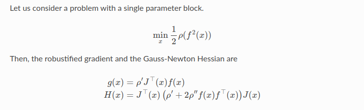
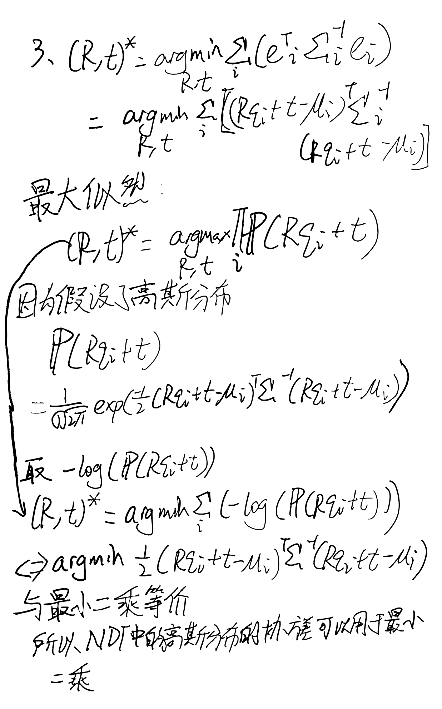
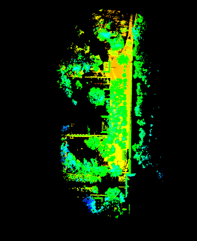
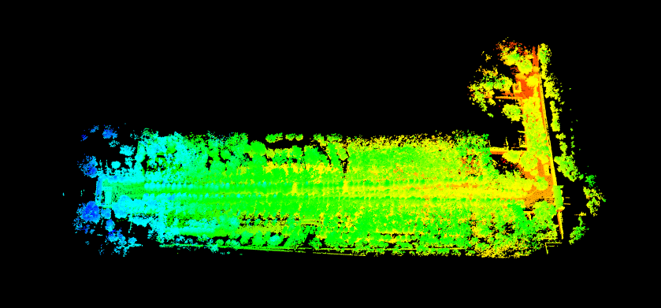

P1:

从ceres上面找到了Cauchy的定义：


对应的鲁棒化的H和g：


再查了一下Ceres的Implementation

```
class CauchyLoss : public LossFunction {
 public:
  explicit CauchyLoss(double a) : b_(a * a), c_(1 / b_) { }
  virtual void Evaluate(double, double*) const;
 private:
  // b = a^2.
  const double b_;
  // c = 1 / a^2.
  const double c_;
};

void CauchyLoss::Evaluate(double s, double rho[3]) const {
  const double sum = 1 + s * c_;
  const double inv = 1 / sum;
  // 'sum' and 'inv' are always positive, assuming that 's' is.
  rho[0] = b_ * log(sum);
  rho[1] = inv;
  rho[2] = - c_ * (inv * inv);
}
```

借用ceres实现，
没有改雅各比和惨差，在H和g实现鲁棒化。
以下是Edge Plane和Line的实现：

Edge：
```
auto H_and_err = std::accumulate(
    index.begin(), index.end(), std::pair<Mat6d, Vec6d>(Mat6d::Zero(), Vec6d::Zero()),
    [&jacobians, &errors, &effect_pts, &total_res, &effective_num](const std::pair<Mat6d, Vec6d>& pre,
                                                                   int idx) -> std::pair<Mat6d, Vec6d> {
        if (!effect_pts[idx]) {
            return pre;
        } else {
            // total_res += errors[idx].dot(errors[idx]);
            // effective_num++;
            // return std::pair<Mat6d, Vec6d>(pre.first + jacobians[idx].transpose() * jacobians[idx],
            //                                pre.second - jacobians[idx].transpose() * errors[idx]);
            double c_ = 1.0;
            double b_ = 1/c_;
            double s = errors[idx].dot(errors[idx]);
            double sum = 1 + s * c_;
            double inv = 1 / sum;

            double p_dot = inv;
            double p_ddot = - c_ * (inv * inv);
            Mat3d info_mat = (p_dot * Mat3d::Identity() + 2 * p_ddot * errors[idx] * errors[idx].transpose());
            total_res += b_ * std::log(sum);
            effective_num++;
            return std::pair<Mat6d, Vec6d>(pre.first + jacobians[idx].transpose() * jacobians[idx],
                                           pre.second - p_dot *jacobians[idx].transpose() * errors[idx]);
        }
    });
```

Plane， 由于plane惨差为标量，不需要transpose，直接将标量平方后乘上 Mat3d::Identity())

```
auto H_and_err = std::accumulate(
    index.begin(), index.end(), std::pair<Mat6d, Vec6d>(Mat6d::Zero(), Vec6d::Zero()),
    [&jacobians, &errors, &effect_pts, &total_res, &effective_num](const std::pair<Mat6d, Vec6d>& pre,
                                                                   int idx) -> std::pair<Mat6d, Vec6d> {
        if (!effect_pts[idx]) {
            return pre;
        } else {
            // total_res += errors[idx] * errors[idx];
            // effective_num++;
            // return std::pair<Mat6d, Vec6d>(pre.first + jacobians[idx].transpose() * jacobians[idx],
            //                                pre.second - jacobians[idx].transpose() * errors[idx]);
            double c_ = 1.0;
            double b_ = 1/c_;
            double s = errors[idx] * errors[idx];
            double sum = 1 + s * c_;
            double inv = 1 / sum;

            double p_dot = inv;
            double p_ddot = - c_ * (inv * inv);
            Mat3d info_mat = (p_dot * Mat3d::Identity() + 2 * p_ddot * errors[idx] * errors[idx] * Mat3d::Identity());
            total_res += b_ * std::log(sum);
            effective_num++;
            return std::pair<Mat6d, Vec6d>(pre.first + jacobians[idx].transpose() * jacobians[idx],
                                           pre.second - p_dot *jacobians[idx].transpose() * errors[idx]);
        }
    });
```

Line：

```
auto H_and_err = std::accumulate(
    index.begin(), index.end(), std::pair<Mat6d, Vec6d>(Mat6d::Zero(), Vec6d::Zero()),
    [&jacobians, &errors, &effect_pts, &total_res, &effective_num](const std::pair<Mat6d, Vec6d>& pre,
                                                                   int idx) -> std::pair<Mat6d, Vec6d> {
        if (!effect_pts[idx]) {
            return pre;
        } else {
            // total_res += errors[idx].dot(errors[idx]);
            // effective_num++;
            // return std::pair<Mat6d, Vec6d>(pre.first + jacobians[idx].transpose() * jacobians[idx],
            //                                pre.second - jacobians[idx].transpose() * errors[idx]);
            double c_ = 1.0;
            double b_ = 1/c_;
            double s = errors[idx].dot(errors[idx]);
            double sum = 1 + s * c_;
            double inv = 1 / sum;

            double p_dot = inv;
            double p_ddot = - c_ * (inv * inv);
            Mat3d info_mat = (p_dot * Mat3d::Identity() + 2 * p_ddot * errors[idx] * errors[idx].transpose());
            total_res += b_ * std::log(sum);
            effective_num++;
            return std::pair<Mat6d, Vec6d>(pre.first + jacobians[idx].transpose() * jacobians[idx],
                                           pre.second - p_dot *jacobians[idx].transpose() * errors[idx]);
        }
    });

if (effective_num < options_.min_effective_pts_) {
    LOG(WARNING) << "effective num too small: " << effective_num;
    return false;
}
```

效果：

原来：

```
I0922 15:46:24.483126 208336 icp_3d.cc:13] aligning with point to point
I0922 15:46:24.492687 208336 icp_3d.cc:109] iter 0 total res: 11.5456, eff: 44501, mean res: 0.000259445, dxn: 0.0271892
I0922 15:46:24.492722 208336 icp_3d.cc:114] iter 0 pose error: 0.068906
I0922 15:46:24.499920 208336 icp_3d.cc:109] iter 1 total res: 6.14758, eff: 44515, mean res: 0.000138101, dxn: 0.0208747
I0922 15:46:24.499940 208336 icp_3d.cc:114] iter 1 pose error: 0.048196
I0922 15:46:24.506455 208336 icp_3d.cc:109] iter 2 total res: 3.09004, eff: 44515, mean res: 6.94156e-05, dxn: 0.0151429
I0922 15:46:24.506476 208336 icp_3d.cc:114] iter 2 pose error: 0.0331744
I0922 15:46:24.512423 208336 icp_3d.cc:109] iter 3 total res: 1.53131, eff: 44515, mean res: 3.43999e-05, dxn: 0.0106252
I0922 15:46:24.512441 208336 icp_3d.cc:114] iter 3 pose error: 0.0226416
I0922 15:46:24.518066 208336 icp_3d.cc:109] iter 4 total res: 0.771542, eff: 44515, mean res: 1.73322e-05, dxn: 0.00738078
I0922 15:46:24.518085 208336 icp_3d.cc:114] iter 4 pose error: 0.0153402
I0922 15:46:24.518086 208336 icp_3d.cc:118] converged, dx = 000.00535717 0-0.00211536 00-0.0034801 -0.000892997 000.00178076 0-0.00228524
I0922 15:46:24.518110 208336 test_icp.cc:55] icp p2p align success, pose: 00.0265477 -0.0107404 00-0.02348 000.999314, -0.0688928 0-0.103293 0.00503551
I0922 15:46:24.598249 208336 sys_utils.h:32] 方法 ICP P2P 平均调用时间/次数: 201.596/1 毫秒.
I0922 15:46:24.598536 208336 icp_3d.h:54] source center: 0.0903871 00.407958 00.251414
I0922 15:46:24.707469 208336 icp_3d.h:45] target center: 0.0338123 00.285905 00.280259
I0922 15:46:24.707491 208336 icp_3d.cc:128] aligning with point to plane
I0922 15:46:24.729262 208336 icp_3d.cc:233] iter 0 total res: 9.30556, eff: 44488, mean res: 0.00020917, dxn: 0.0787659
I0922 15:46:24.729286 208336 icp_3d.cc:238] iter 0 pose error: 0.0181569
I0922 15:46:24.748551 208336 icp_3d.cc:233] iter 1 total res: 0.348755, eff: 44515, mean res: 7.83455e-06, dxn: 0.0175244
I0922 15:46:24.748575 208336 icp_3d.cc:238] iter 1 pose error: 0.00070575
I0922 15:46:24.766953 208336 icp_3d.cc:233] iter 2 total res: 0.00386591, eff: 44515, mean res: 8.68451e-08, dxn: 0.000711734
I0922 15:46:24.766975 208336 icp_3d.cc:238] iter 2 pose error: 1.42516e-05
I0922 15:46:24.766979 208336 icp_3d.cc:242] converged, dx = 00.000455479 -0.000187054 -5.23165e-05 0008.557e-05 00.000450942 -0.000225182
I0922 15:46:24.766991 208336 test_icp.cc:76] icp p2plane align success, pose: 00.0323446 -0.0136961 0-0.026442 000.999033, 00-0.0699089 000-0.101207 -2.88323e-06
I0922 15:46:24.868151 208336 sys_utils.h:32] 方法 ICP P2Plane 平均调用时间/次数: 269.871/1 毫秒.
I0922 15:46:24.868436 208336 icp_3d.h:54] source center: 0.0903871 00.407958 00.251414
I0922 15:46:24.977361 208336 icp_3d.h:45] target center: 0.0338123 00.285905 00.280259
I0922 15:46:24.977383 208336 icp_3d.cc:258] aligning with point to line
I0922 15:46:25.013329 208336 icp_3d.cc:366] iter 0 pose error: 0.123036
I0922 15:46:25.013350 208336 icp_3d.cc:370] iter 0 total res: 131.575, eff: 44498, mean res: 0.00295687, dxn: 0.0526674
I0922 15:46:25.042265 208336 icp_3d.cc:366] iter 1 pose error: 0.102481
I0922 15:46:25.042285 208336 icp_3d.cc:370] iter 1 total res: 61.4035, eff: 44515, mean res: 0.00137939, dxn: 0.0289599
I0922 15:46:25.066031 208336 icp_3d.cc:366] iter 2 pose error: 0.0831711
I0922 15:46:25.066049 208336 icp_3d.cc:370] iter 2 total res: 34.5078, eff: 44515, mean res: 0.000775194, dxn: 0.0223049
I0922 15:46:25.087154 208336 icp_3d.cc:366] iter 3 pose error: 0.06646
I0922 15:46:25.087174 208336 icp_3d.cc:370] iter 3 total res: 20.4796, eff: 44515, mean res: 0.000460061, dxn: 0.018314
I0922 15:46:25.106658 208336 icp_3d.cc:366] iter 4 pose error: 0.0524012
I0922 15:46:25.106678 208336 icp_3d.cc:370] iter 4 total res: 12.6363, eff: 44515, mean res: 0.000283867, dxn: 0.0155191
I0922 15:46:25.124760 208336 icp_3d.cc:366] iter 5 pose error: 0.0413768
I0922 15:46:25.124781 208336 icp_3d.cc:370] iter 5 total res: 7.98029, eff: 44515, mean res: 0.000179272, dxn: 0.0123657
I0922 15:46:25.142410 208336 icp_3d.cc:366] iter 6 pose error: 0.0332998
I0922 15:46:25.142431 208336 icp_3d.cc:370] iter 6 total res: 5.21799, eff: 44515, mean res: 0.000117219, dxn: 0.0091304
I0922 15:46:25.142434 208336 icp_3d.cc:374] converged, dx = -0.000841166 0-0.00585489 0-0.00447198 0-0.00203003 0-0.00491502 -0.000315898
I0922 15:46:25.142446 208336 test_icp.cc:97] icp p2line align success, pose: 0000.031179 -0.00666461 0-0.0226002 0000.999236, -0.0683484 -0.0722198 0.00187162
I0922 15:46:25.234181 208336 sys_utils.h:32] 方法 ICP P2Line 平均调用时间/次数: 366.001/1 毫秒.

```

Cauchy Loss后：

```
I0922 15:44:15.858827 207856 icp_3d.cc:13] aligning with point to point
I0922 15:44:15.869892 207856 icp_3d.cc:109] iter 0 total res: 11.536, eff: 44477, mean res: 0.000259371, dxn: 0.0271601
I0922 15:44:15.869923 207856 icp_3d.cc:114] iter 0 pose error: 0.0689342
I0922 15:44:15.877686 207856 icp_3d.cc:109] iter 1 total res: 6.151, eff: 44515, mean res: 0.000138178, dxn: 0.0208745
I0922 15:44:15.877714 207856 icp_3d.cc:114] iter 1 pose error: 0.0482241
I0922 15:44:15.885217 207856 icp_3d.cc:109] iter 2 total res: 3.09302, eff: 44515, mean res: 6.94827e-05, dxn: 0.0151503
I0922 15:44:15.885242 207856 icp_3d.cc:114] iter 2 pose error: 0.0331954
I0922 15:44:15.892215 207856 icp_3d.cc:109] iter 3 total res: 1.53284, eff: 44515, mean res: 3.44343e-05, dxn: 0.0106306
I0922 15:44:15.892242 207856 icp_3d.cc:114] iter 3 pose error: 0.0226571
I0922 15:44:15.899240 207856 icp_3d.cc:109] iter 4 total res: 0.772409, eff: 44515, mean res: 1.73517e-05, dxn: 0.00738264
I0922 15:44:15.899266 207856 icp_3d.cc:114] iter 4 pose error: 0.0153542
I0922 15:44:15.899269 207856 icp_3d.cc:118] converged, dx = 000.00535851 0-0.00211314 0-0.00348197 -0.000894222 000.00178175 0-0.00228606
I0922 15:44:15.899298 207856 test_icp.cc:55] icp p2p align success, pose: 00.0265433 -0.0107366 -0.0234769 000.999314, -0.0688923 0-0.103296 00.0050407
I0922 15:44:16.004223 207856 sys_utils.h:32] 方法 ICP P2P 平均调用时间/次数: 261.248/1 毫秒.
I0922 15:44:16.004515 207856 icp_3d.h:54] source center: 0.0903871 00.407958 00.251414
I0922 15:44:16.114833 207856 icp_3d.h:45] target center: 0.0338123 00.285905 00.280259
I0922 15:44:16.114868 207856 icp_3d.cc:128] aligning with point to plane
I0922 15:44:16.136611 207856 icp_3d.cc:233] iter 0 total res: 9.30121, eff: 44493, mean res: 0.000209049, dxn: 0.0787099
I0922 15:44:16.136637 207856 icp_3d.cc:238] iter 0 pose error: 0.0182051
I0922 15:44:16.155733 207856 icp_3d.cc:233] iter 1 total res: 0.350877, eff: 44515, mean res: 7.88222e-06, dxn: 0.0175693
I0922 15:44:16.155757 207856 icp_3d.cc:238] iter 1 pose error: 0.000708864
I0922 15:44:16.174499 207856 icp_3d.cc:233] iter 2 total res: 0.00387137, eff: 44515, mean res: 8.69677e-08, dxn: 0.000714759
I0922 15:44:16.174523 207856 icp_3d.cc:238] iter 2 pose error: 1.39842e-05
I0922 15:44:16.174526 207856 icp_3d.cc:242] converged, dx = 00.000461134 -0.000183278 -5.23631e-05 08.55717e-05 00.000450562 -0.000227101
I0922 15:44:16.174539 207856 test_icp.cc:76] icp p2plane align success, pose: 00.0323444 -0.0136962 -0.0264418 000.999033, 00-0.0699088 000-0.101207 -2.78654e-06
I0922 15:44:16.267227 207856 sys_utils.h:32] 方法 ICP P2Plane 平均调用时间/次数: 262.97/1 毫秒.
I0922 15:44:16.267442 207856 icp_3d.h:54] source center: 0.0903871 00.407958 00.251414
I0922 15:44:16.349102 207856 icp_3d.h:45] target center: 0.0338123 00.285905 00.280259
I0922 15:44:16.349129 207856 icp_3d.cc:258] aligning with point to line
I0922 15:44:16.385124 207856 icp_3d.cc:366] iter 0 pose error: 0.123284
I0922 15:44:16.385145 207856 icp_3d.cc:370] iter 0 total res: 131.058, eff: 44509, mean res: 0.00294453, dxn: 0.0522762
I0922 15:44:16.413074 207856 icp_3d.cc:366] iter 1 pose error: 0.102708
I0922 15:44:16.413095 207856 icp_3d.cc:370] iter 1 total res: 61.6294, eff: 44515, mean res: 0.00138446, dxn: 0.0289524
I0922 15:44:16.437381 207856 icp_3d.cc:366] iter 2 pose error: 0.083452
I0922 15:44:16.437402 207856 icp_3d.cc:370] iter 2 total res: 34.6576, eff: 44515, mean res: 0.000778559, dxn: 0.0222842
I0922 15:44:16.458957 207856 icp_3d.cc:366] iter 3 pose error: 0.0666829
I0922 15:44:16.458981 207856 icp_3d.cc:370] iter 3 total res: 20.615, eff: 44515, mean res: 0.000463102, dxn: 0.0183714
I0922 15:44:16.479362 207856 icp_3d.cc:366] iter 4 pose error: 0.0525731
I0922 15:44:16.479383 207856 icp_3d.cc:370] iter 4 total res: 12.7295, eff: 44515, mean res: 0.000285961, dxn: 0.0155572
I0922 15:44:16.498147 207856 icp_3d.cc:366] iter 5 pose error: 0.0415187
I0922 15:44:16.498168 207856 icp_3d.cc:370] iter 5 total res: 8.04771, eff: 44515, mean res: 0.000180786, dxn: 0.0124147
I0922 15:44:16.516013 207856 icp_3d.cc:366] iter 6 pose error: 0.0334409
I0922 15:44:16.516034 207856 icp_3d.cc:370] iter 6 total res: 5.26547, eff: 44515, mean res: 0.000118285, dxn: 0.00912384
I0922 15:44:16.516038 207856 icp_3d.cc:374] converged, dx = 0-0.00081668 0-0.00584497 0-0.00446407 0-0.00203424 0-0.00492357 -0.000325862
I0922 15:44:16.516048 207856 test_icp.cc:97] icp p2line align success, pose: 00.0311349 -0.0066589 -0.0225553 000.999238, -0.0683075 -0.0720996 0.00191959
I0922 15:44:16.604077 207856 sys_utils.h:32] 方法 ICP P2Line 平均调用时间/次数: 336.822/1 毫秒.
```

可以看出除了P2P的速度有进步之外，迭代次数，速度和惨差结果都差不了太多。

P2:
接下来修改ndt的H和g总体和P1没大区别，唯一的区别是H和g的形式不以std::pair形式。

```
for (int idx = 0; idx < effect_pts.size(); ++idx) {
    if (!effect_pts[idx]) {
        continue;
    }

    // total_res += errors[idx].transpose() * infos[idx] * errors[idx];
    // effective_num++;

    // H += jacobians[idx].transpose() * infos[idx] * jacobians[idx];
    // err += -jacobians[idx].transpose() * infos[idx] * errors[idx];

    double b_ = 1;
    double c_ = 1/b_;
    // double b_ = 1/c_;
    double s = errors[idx].dot(errors[idx]);
    double sum = 1 + s * c_;
    double inv = 1 / sum;

    double p_dot = inv;
    double p_ddot = - c_ * (inv * inv);
    Mat3d info_mat = (p_dot * infos[idx]);
    total_res += b_ * std::log(sum);
    effective_num++;
    H += jacobians[idx].transpose() * infos[idx] * jacobians[idx];
    err += - p_dot *jacobians[idx].transpose() * infos[idx] * errors[idx];
}
```
效果：
原来：

```
I0922 15:59:05.856832 209289 ndt_3d.cc:69] aligning with ndt
I0922 15:59:05.856839 209289 ndt_3d.cc:75] init trans set to -0.0565748 0-0.122053 00.0288451
I0922 15:59:05.860137 209289 ndt_3d.cc:184] iter 0 total res: 135419, eff: 43835, mean res: 3.0893, dxn: 0.0322039, dx: 0000.0209522 -0.000740313 000-0.021024 0-0.00772221 000.00691035 0-0.00693946
I0922 15:59:05.860157 209289 ndt_3d.cc:194] iter 0 pose error: 0.0659272
I0922 15:59:05.863266 209289 ndt_3d.cc:184] iter 1 total res: 134461, eff: 43961, mean res: 3.05864, dxn: 0.0207414, dx: 000.0152549 -0.00154469 0-0.0108969 -0.00475293 00.00483602 -0.00551257
I0922 15:59:05.863283 209289 ndt_3d.cc:194] iter 1 pose error: 0.0472543
I0922 15:59:05.866952 209289 ndt_3d.cc:184] iter 2 total res: 133966, eff: 43957, mean res: 3.04767, dxn: 0.0143901, dx: 0000.0100465 0-0.00475818 0-0.00718073 -0.000849644 0000.0031615 0-0.00460675
I0922 15:59:05.866973 209289 ndt_3d.cc:194] iter 2 pose error: 0.033418
I0922 15:59:05.870353 209289 ndt_3d.cc:184] iter 3 total res: 133627, eff: 44047, mean res: 3.03374, dxn: 0.00981946, dx: 00.00766541 -0.00189296 -0.00396515 -0.00200056 00.00220428 -0.00308165
I0922 15:59:05.870369 209289 ndt_3d.cc:194] iter 3 pose error: 0.0253531
I0922 15:59:05.870373 209289 ndt_3d.cc:198] converged, dx = 00.00766541 -0.00189296 -0.00396515 -0.00200056 00.00220428 -0.00308165
I0922 15:59:05.870383 209289 test_icp.cc:122] ndt align success, pose: 000.0269024 -0.00453437 000-0.02158 0000.999395, -0.0719002 0-0.104941 0.00870465
I0922 15:59:05.922374 209289 sys_utils.h:32] 方法 NDT 平均调用时间/次数: 75.9102/1 毫秒.
```

Cauchy Loss：

```
I0922 16:25:47.831558 214390 ndt_3d.cc:69] aligning with ndt
I0922 16:25:47.831573 214390 ndt_3d.cc:75] init trans set to -0.0565748 0-0.122053 00.0288451
I0922 16:25:47.835912 214390 ndt_3d.cc:185] iter 0 total res: 3662.92, eff: 43805, mean res: 0.0836188, dxn: 0.0314282, dx: 000.0204736 -0.00187629 0-0.0205066 -0.00716143 00.00634771 0-0.0072765
I0922 16:25:47.835940 214390 ndt_3d.cc:195] iter 0 pose error: 0.0661092
I0922 16:25:47.840389 214390 ndt_3d.cc:185] iter 1 total res: 3620.17, eff: 43672, mean res: 0.0828945, dxn: 0.0200466, dx: 0000.0156155 -0.000505654 0-0.00925615 0-0.00470507 000.00447942 0-0.00546689
I0922 16:25:47.840411 214390 ndt_3d.cc:195] iter 1 pose error: 0.0483588
I0922 16:25:47.844527 214390 ndt_3d.cc:185] iter 2 total res: 3644.39, eff: 44245, mean res: 0.0823684, dxn: 0.0152407, dx: 0000.010823 -0.00326597 -0.00799243 -0.00176769 00.00383683 -0.00476971
I0922 16:25:47.844547 214390 ndt_3d.cc:195] iter 2 pose error: 0.0343833
I0922 16:25:47.848506 214390 ndt_3d.cc:185] iter 3 total res: 3608.59, eff: 44053, mean res: 0.0819148, dxn: 0.0110921, dx: 00.00771406 -0.00282555 -0.00579165 -0.00181451 000.0025642 -0.00348343
I0922 16:25:47.848524 214390 ndt_3d.cc:195] iter 3 pose error: 0.0249561
I0922 16:25:47.852448 214390 ndt_3d.cc:185] iter 4 total res: 3608.81, eff: 44164, mean res: 0.0817139, dxn: 0.00765844, dx: 000.00457909 0-0.00368239 0-0.00405502 -0.000589831 000.00124472 0-0.00240484
I0922 16:25:47.852470 214390 ndt_3d.cc:195] iter 4 pose error: 0.0181828
I0922 16:25:47.852475 214390 ndt_3d.cc:199] converged, dx = 000.00457909 0-0.00368239 0-0.00405502 -0.000589831 000.00124472 0-0.00240484
I0922 16:25:47.852486 214390 test_icp.cc:122] ndt align success, pose: 000.0295277 -0.00611619 0-0.0238757 00000.99926, -0.0726133 00-0.10358 0.00544371
I0922 16:25:47.919783 214390 sys_utils.h:32] 方法 NDT 平均调用时间/次数: 102.859/1 毫秒.

```

可以看出速度稍微慢一些，但是惨差比原来的效果好很多

P3:



P4:
首先增加了一个segmentGround函数，
进来的点云滤掉高于一定高度的点云滤掉，然后再找最大的平面作为地面
```
void 
FeatureExtraction::SegmentGround (CloudPtr pc_all, CloudPtr pc_ground)
{
  CloudPtr cloud_pass_through_height(new pcl::PointCloud<PointType>);
  pcl::PassThrough<PointType> pass_through_height;
  pass_through_height.setInputCloud(pc_all);
  pass_through_height.setFilterFieldName("z");
  pass_through_height.setFilterLimits(-1, 0);
  pass_through_height.filter(*cloud_pass_through_height);

  Eigen::VectorXf plane_coefficients(4); 
  pcl::Indices inlier_indices;
  pcl::PointIndices::Ptr inliers (new pcl::PointIndices);
  // Perform Sample Concensus
  pcl::SampleConsensusModelPlane<PointType>::Ptr plane_model_around_ground(new pcl::SampleConsensusModelPlane<PointType> (cloud_pass_through_height));
  pcl::RandomSampleConsensus<PointType> ransac_algo(plane_model_around_ground, 0.1);
  ransac_algo.computeModel();
  ransac_algo.getModelCoefficients(plane_coefficients);
  pcl::SampleConsensusModelPlane<PointType>::Ptr plane_model_whole(new pcl::SampleConsensusModelPlane<PointType> (pc_all));
  plane_model_whole->selectWithinDistance(plane_coefficients, 0.10, inlier_indices);
  inliers->indices = inlier_indices;

  // Extract Inliers from the point cloud
  // Instantiate extract object
  pcl::ExtractIndices<PointType> extract;
  // Set extract parameters
  extract.setInputCloud (pc_all);
  extract.setIndices (inliers);
  extract.setNegative (false);
  extract.filter (*pc_ground);

  CloudPtr pc_ground_removed(new PointCloudType);
  extract.setNegative (true);
  extract.filter (*pc_ground_removed);

  pcl::io::savePCDFileBinaryCompressed("./data/ch7/ground.pcd", *pc_ground);
  pcl::io::savePCDFileBinaryCompressed("./data/ch7/ground_filtered.pcd", *pc_ground_removed);
}
```

在Loam_like_odom.cc中像处理edge和surf一样处理ground：

```
void LoamLikeOdom::ProcessPointCloud(FullCloudPtr cloud) {
    LOG(INFO) << "processing frame " << cnt_frame_++;
    // step 1. 提特征
    CloudPtr current_edge(new PointCloudType), current_surf(new PointCloudType), current_ground(new PointCloudType);
    feature_extraction_->Extract(cloud, current_edge, current_surf, current_ground);

    if (current_edge->size() < options_.min_edge_pts_ || current_surf->size() < options_.min_surf_pts_ || current_ground->size() < options_.min_ground_pts) {
        LOG(ERROR) << "not enough edge/surf pts: " << current_edge->size() << "," << current_surf->size();
        return;
    }

    LOG(INFO) << "edge: " << current_edge->size() << ", surf: " << current_surf->size() << ", grouond: " << current_ground->size();

    if (local_map_edge_ == nullptr || local_map_surf_ == nullptr) {
        // 首帧特殊处理
        local_map_edge_ = current_edge;
        local_map_surf_ = current_surf;
        local_map_ground_ = current_ground;

        kdtree_edge_.BuildTree(local_map_edge_);
        kdtree_surf_.BuildTree(local_map_surf_);
        kdtree_ground_.BuildTree(local_map_ground_);

        edges_.emplace_back(current_edge);
        surfs_.emplace_back(current_surf);
        grounds_.emplace_back(current_ground);
        return;
    }

    /// 与局部地图配准
    SE3 pose = AlignWithLocalMap(current_edge, current_surf, current_ground);
    CloudPtr scan_world(new PointCloudType);
    pcl::transformPointCloud(*ConvertToCloud<FullPointType>(cloud), *scan_world, pose.matrix());

    CloudPtr edge_world(new PointCloudType), surf_world(new PointCloudType), ground_world(new PointCloudType);
    pcl::transformPointCloud(*current_edge, *edge_world, pose.matrix());
    pcl::transformPointCloud(*current_surf, *surf_world, pose.matrix());
    pcl::transformPointCloud(*current_ground, *ground_world, pose.matrix());

    if (IsKeyframe(pose)) {
        LOG(INFO) << "inserting keyframe";
        last_kf_pose_ = pose;
        last_kf_id_ = cnt_frame_;

        // 重建local map
        edges_.emplace_back(edge_world);
        surfs_.emplace_back(surf_world);
        grounds_.emplace_back(ground_world);

        if (edges_.size() > options_.num_kfs_in_local_map_) {
            edges_.pop_front();
        }
        if (surfs_.size() > options_.num_kfs_in_local_map_) {
            surfs_.pop_front();
        }
        if (grounds_.size() > options_.num_kfs_in_local_map_) {
            grounds_.pop_front();
        }

        local_map_surf_.reset(new PointCloudType);
        local_map_edge_.reset(new PointCloudType);
        local_map_ground_.reset(new PointCloudType);

        for (auto& s : edges_) {
            *local_map_edge_ += *s;
        }
        for (auto& s : surfs_) {
            *local_map_surf_ += *s;
        }
        for (auto& s : grounds_) {
            *local_map_ground_ += *s;
        }

        local_map_surf_ = VoxelCloud(local_map_surf_, 1.0);
        local_map_edge_ = VoxelCloud(local_map_edge_, 1.0);
        local_map_ground_ = VoxelCloud(local_map_ground_, 1.0);

        LOG(INFO) << "insert keyframe, surf pts: " << local_map_surf_->size()
                  << ", edge pts: " << local_map_edge_->size()
                  << ", ground pts: " << local_map_ground_->size();

        kdtree_surf_.BuildTree(local_map_surf_);
        kdtree_edge_.BuildTree(local_map_edge_);
        kdtree_ground_.BuildTree(local_map_ground_);

        *global_map_ += *scan_world;
    }

    LOG(INFO) << "current pose: " << pose.translation().transpose() << ", "
              << pose.so3().unit_quaternion().coeffs().transpose();

    if (viewer_ != nullptr) {
        viewer_->SetPoseAndCloud(pose, scan_world);
    }
}

SE3 LoamLikeOdom::AlignWithLocalMap(CloudPtr edge, CloudPtr surf, CloudPtr ground) {
    // 这部分的ICP需要自己写
    SE3 pose;
    if (estimated_poses_.size() >= 2) {
        // 从最近两个pose来推断
        SE3 T1 = estimated_poses_[estimated_poses_.size() - 1];
        SE3 T2 = estimated_poses_[estimated_poses_.size() - 2];
        pose = T1 * (T2.inverse() * T1);
    }

    int edge_size = edge->size();
    int surf_size = surf->size();
    int ground_size = ground->size();

    // 我们来写一些并发代码
    for (int iter = 0; iter < options_.max_iteration_; ++iter) {
        std::vector<bool> effect_surf(surf_size, false);
        std::vector<Eigen::Matrix<double, 1, 6>> jacob_surf(surf_size);  // 点面的残差是1维的
        std::vector<double> errors_surf(surf_size);

        std::vector<bool> effect_ground(ground_size, false);
        std::vector<Eigen::Matrix<double, 1, 6>> jacob_ground(ground_size);  // 点面的残差是1维的
        std::vector<double> errors_ground(ground_size);

        std::vector<bool> effect_edge(edge_size, false);
        std::vector<Eigen::Matrix<double, 3, 6>> jacob_edge(edge_size);  // 点线的残差是3维的
        std::vector<Vec3d> errors_edge(edge_size);

        std::vector<int> index_surf(surf_size);
        std::iota(index_surf.begin(), index_surf.end(), 0);  // 填入
        std::vector<int> index_edge(edge_size);
        std::iota(index_edge.begin(), index_edge.end(), 0);  // 填入
        std::vector<int> index_ground(ground_size);
        std::iota(index_ground.begin(), index_ground.end(), 0);  // 填入

        // gauss-newton 迭代
        // 最近邻，角点部分
        if (options_.use_edge_points_) {
            std::for_each(std::execution::par_unseq, index_edge.begin(), index_edge.end(), [&](int idx) {
                Vec3d q = ToVec3d(edge->points[idx]);
                Vec3d qs = pose * q;

                // 检查最近邻
                std::vector<int> nn_indices;

                kdtree_edge_.GetClosestPoint(ToPointType(qs), nn_indices, 5);
                effect_edge[idx] = false;

                if (nn_indices.size() >= 3) {
                    std::vector<Vec3d> nn_eigen;
                    for (auto& n : nn_indices) {
                        nn_eigen.emplace_back(ToVec3d(local_map_edge_->points[n]));
                    }

                    // point to point residual
                    Vec3d d, p0;
                    if (!math::FitLine(nn_eigen, p0, d, options_.max_line_distance_)) {
                        return;
                    }

                    Vec3d err = SO3::hat(d) * (qs - p0);
                    if (err.norm() > options_.max_line_distance_) {
                        return;
                    }

                    effect_edge[idx] = true;

                    // build residual
                    Eigen::Matrix<double, 3, 6> J;
                    J.block<3, 3>(0, 0) = -SO3::hat(d) * pose.so3().matrix() * SO3::hat(q);
                    J.block<3, 3>(0, 3) = SO3::hat(d);

                    jacob_edge[idx] = J;
                    errors_edge[idx] = err;
                }
            });
        }

        /// 最近邻，平面点部分
        if (options_.use_surf_points_) {
            std::for_each(std::execution::par_unseq, index_surf.begin(), index_surf.end(), [&](int idx) {
                Vec3d q = ToVec3d(surf->points[idx]);
                Vec3d qs = pose * q;

                // 检查最近邻
                std::vector<int> nn_indices;

                kdtree_surf_.GetClosestPoint(ToPointType(qs), nn_indices, 5);
                effect_surf[idx] = false;

                if (nn_indices.size() == 5) {
                    std::vector<Vec3d> nn_eigen;
                    for (auto& n : nn_indices) {
                        nn_eigen.emplace_back(ToVec3d(local_map_surf_->points[n]));
                    }

                    // 点面残差
                    Vec4d n;
                    if (!math::FitPlane(nn_eigen, n)) {
                        return;
                    }

                    double dis = n.head<3>().dot(qs) + n[3];
                    if (fabs(dis) > options_.max_plane_distance_) {
                        return;
                    }

                    effect_surf[idx] = true;

                    // build residual
                    Eigen::Matrix<double, 1, 6> J;
                    J.block<1, 3>(0, 0) = -n.head<3>().transpose() * pose.so3().matrix() * SO3::hat(q);
                    J.block<1, 3>(0, 3) = n.head<3>().transpose();

                    jacob_surf[idx] = J;
                    errors_surf[idx] = dis;
                }
            });
        }

        /// 最近邻，di面点部分
        if (options_.use_ground_points_) {
            std::for_each(std::execution::par_unseq, index_ground.begin(), index_ground.end(), [&](int idx) {
                Vec3d q = ToVec3d(ground->points[idx]);
                Vec3d qs = pose * q;

                // 检查最近邻
                std::vector<int> nn_indices;

                kdtree_ground_.GetClosestPoint(ToPointType(qs), nn_indices, 5);
                effect_ground[idx] = false;

                if (nn_indices.size() == 5) {
                    std::vector<Vec3d> nn_eigen;
                    for (auto& n : nn_indices) {
                        nn_eigen.emplace_back(ToVec3d(local_map_ground_->points[n]));
                    }

                    // 点面残差
                    Vec4d n;
                    if (!math::FitPlane(nn_eigen, n)) {
                        return;
                    }

                    double dis = n.head<3>().dot(qs) + n[3];
                    if (fabs(dis) > options_.max_plane_distance_) {
                        return;
                    }

                    effect_ground[idx] = true;

                    // build residual
                    Eigen::Matrix<double, 1, 6> J;
                    J.block<1, 3>(0, 0) = -n.head<3>().transpose() * pose.so3().matrix() * SO3::hat(q);
                    J.block<1, 3>(0, 3) = n.head<3>().transpose();

                    jacob_ground[idx] = J;
                    errors_ground[idx] = dis;
                }
            });
        }

        // 累加Hessian和error,计算dx
        // 原则上可以用reduce并发，写起来比较麻烦，这里写成accumulate
        double total_res = 0;
        int effective_num = 0;

        Mat6d H = Mat6d::Zero();
        Vec6d err = Vec6d::Zero();

        for (const auto& idx : index_surf) {
            if (effect_surf[idx]) {
                H += jacob_surf[idx].transpose() * jacob_surf[idx];
                err += -jacob_surf[idx].transpose() * errors_surf[idx];
                effective_num++;
                total_res += errors_surf[idx] * errors_surf[idx];
            }
        }

        for (const auto& idx : index_edge) {
            if (effect_edge[idx]) {
                H += jacob_edge[idx].transpose() * jacob_edge[idx];
                err += -jacob_edge[idx].transpose() * errors_edge[idx];
                effective_num++;
                total_res += errors_edge[idx].norm();
            }
        }

        for (const auto& idx : index_ground) {
            if (effect_ground[idx]) {
                H += jacob_ground[idx].transpose() * jacob_ground[idx];
                err += -jacob_ground[idx].transpose() * errors_ground[idx];
                effective_num++;
                total_res += errors_ground[idx] * errors_ground[idx];
            }
        }

        if (effective_num < options_.min_effective_pts_) {
            LOG(WARNING) << "effective num too small: " << effective_num;
            return pose;
        }

        Vec6d dx = H.inverse() * err;
        pose.so3() = pose.so3() * SO3::exp(dx.head<3>());
        pose.translation() += dx.tail<3>();

        // 更新
        LOG(INFO) << "iter " << iter << " total res: " << total_res << ", eff: " << effective_num
                  << ", mean res: " << total_res / effective_num << ", dxn: " << dx.norm();

        if (dx.norm() < options_.eps_) {
            LOG(INFO) << "converged, dx = " << dx.transpose();
            break;
        }
    }

    estimated_poses_.emplace_back(pose);
    return pose;
}
```

做出来的效果没有大差别



